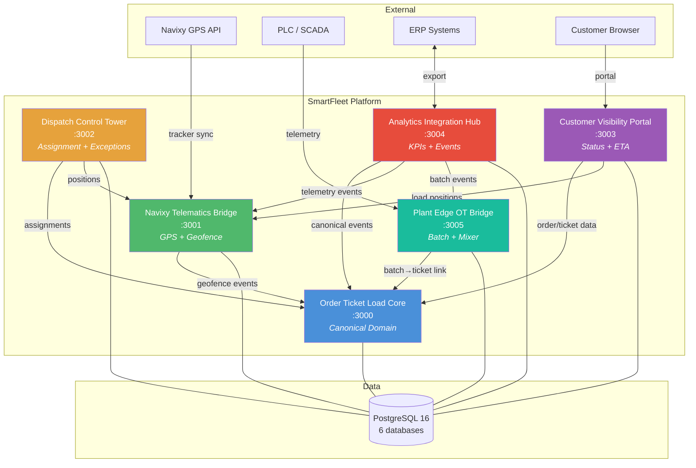

# SmartFleet Dispatch Portfolio

[](https://github.com/DonTicapo/smartfleet-dispatch-portfolio/actions/workflows/ci.yml)
[](https://donticapo.github.io/smartfleet-dispatch-portfolio/)
[](./LICENSE)
[](https://www.typescriptlang.org/)
[](https://nodejs.org/)
[](https://fastify.dev/)
[](https://www.postgresql.org/)
[](https://react.dev/)

Full-stack ready-mix concrete dispatch platform — 6 bounded-context microservices demonstrating domain-driven design, event-driven architecture, and operational technology integration.

> **[View Live Landing Page](https://donticapo.github.io/smartfleet-dispatch-portfolio/)** | **[Browse API Collection](./api-collection/)**

## Architecture



| Service | Port | Description |
|---------|------|-------------|
| [order-ticket-load-core](./order-ticket-load-core) | 3000 | Canonical domain: customers, jobs, orders, tickets, loads, delivery events |
| [navixy-telematics-bridge](./navixy-telematics-bridge) | 3001 | Telematics integration: GPS tracking, geofence inference, store-and-forward |
| [dispatch-control-tower](./dispatch-control-tower) | 3002 | Dispatch operations: truck/driver assignment, exception handling, board |
| [customer-visibility-portal](./customer-visibility-portal) | 3003 | Customer portal: order status, ETA tracking, delivery messaging |
| [analytics-integration-hub](./analytics-integration-hub) | 3004 | Analytics: event ingestion, KPI computation, ERP export, webhooks |
| [plant-edge-ot-bridge](./plant-edge-ot-bridge) | 3005 | Plant edge: batch events, scale readings, mixer state machine, offline sync |

## Tech Stack

- **Runtime:** Node.js 22+ / TypeScript (ES modules)
- **Framework:** Fastify 5
- **Database:** PostgreSQL 16
- **Validation:** Zod
- **Auth:** JWT (Bearer)
- **Testing:** Vitest
- **ORM/Query:** Knex
- **Docs:** OpenAPI / Swagger UI

## Quick Start

### Prerequisites
- Node.js >= 22
- PostgreSQL 16+ (or Docker)

### Option A: Docker (recommended)
```bash
docker compose up -d
```
This starts all 6 services + a shared PostgreSQL instance. Then run migrations:
```bash
for dir in order-ticket-load-core navixy-telematics-bridge dispatch-control-tower customer-visibility-portal analytics-integration-hub plant-edge-ot-bridge; do
  (cd $dir && npm run migrate)
done
```

### Option B: Local development
```bash
# Install dependencies for all projects
for dir in order-ticket-load-core navixy-telematics-bridge dispatch-control-tower customer-visibility-portal analytics-integration-hub plant-edge-ot-bridge; do
  (cd $dir && npm install)
done

# Start PostgreSQL and create databases (see scripts/init-databases.sql)

# Run migrations
for dir in order-ticket-load-core navixy-telematics-bridge dispatch-control-tower customer-visibility-portal analytics-integration-hub plant-edge-ot-bridge; do
  (cd $dir && npm run migrate)
done

# Start services (each in its own terminal)
cd order-ticket-load-core && npm run dev
cd navixy-telematics-bridge && npm run dev
cd dispatch-control-tower && npm run dev
cd customer-visibility-portal && npm run dev
cd analytics-integration-hub && npm run dev
cd plant-edge-ot-bridge && npm run dev
```

### Option C: Seed demo data
```bash
for dir in order-ticket-load-core navixy-telematics-bridge dispatch-control-tower customer-visibility-portal analytics-integration-hub plant-edge-ot-bridge; do
  (cd $dir && npm run seed)
done
```

## Testing
```bash
# Run all tests
for dir in order-ticket-load-core navixy-telematics-bridge dispatch-control-tower customer-visibility-portal analytics-integration-hub plant-edge-ot-bridge; do
  echo "--- $dir ---"
  (cd $dir && npm test)
done
```

## API Documentation
Each service exposes Swagger UI at `/docs`:
- http://localhost:3000/docs — Order/Ticket/Load Core
- http://localhost:3001/docs — Navixy Telematics Bridge
- http://localhost:3002/docs — Dispatch Control Tower
- http://localhost:3003/docs — Customer Visibility Portal
- http://localhost:3004/docs — Analytics Integration Hub
- http://localhost:3005/docs — Plant Edge OT Bridge

## Project Structure
Each service follows identical DDD layered architecture:
```
service-name/
├── src/
│   ├── domain/          # Entities, enums, value objects, errors, state machines
│   ├── application/     # Services (use-case orchestration)
│   ├── infrastructure/  # Repositories, middleware, DB, external clients
│   └── interfaces/      # HTTP routes, schemas, Swagger
├── tests/               # Unit + integration tests
├── package.json
├── tsconfig.json
└── knexfile.ts
```
