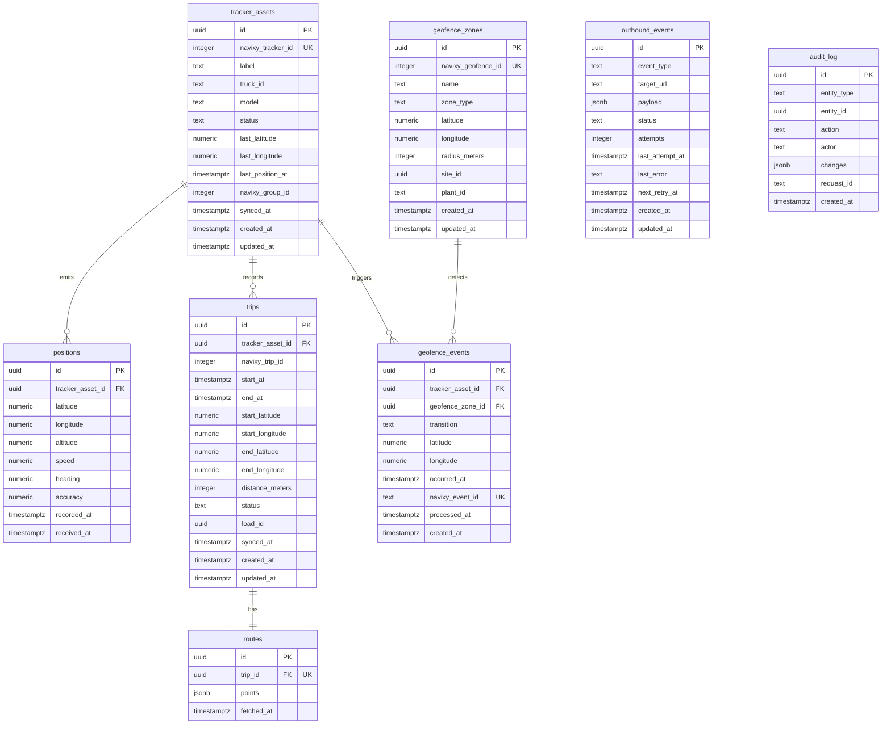
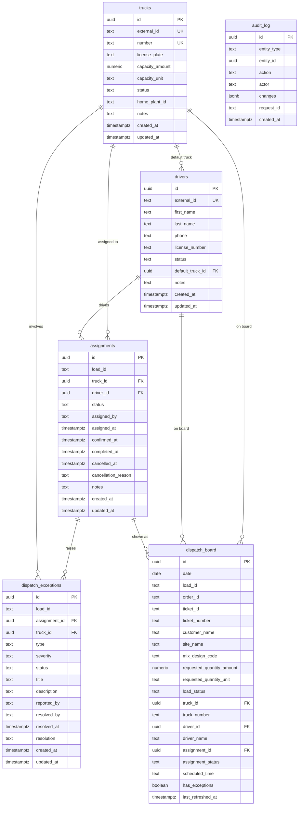
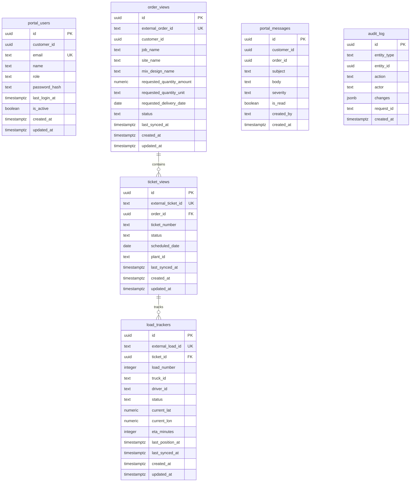
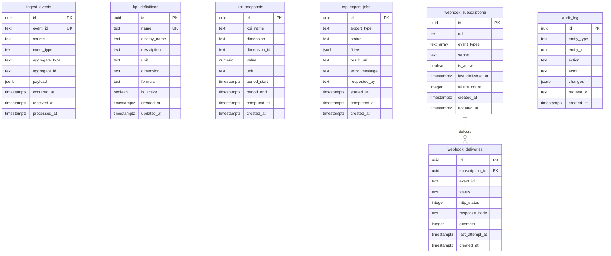
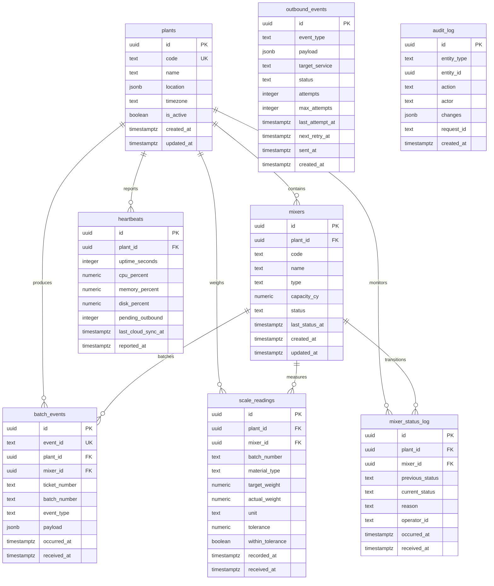

# Database Schema -- SmartFleet Dispatch Portfolio

6 PostgreSQL databases across 6 bounded-context microservices.

Each database uses the `pgcrypto` extension for `gen_random_uuid()`. Every database
includes a shared `audit_log` table pattern. Foreign key relationships are internal
to each service; cross-service references use stable text identifiers (never direct
FK pointers) to preserve bounded-context autonomy.

---

## Order Ticket Load Core (`otl_core`)

Canonical domain platform: customers, jobs, sites, orders, tickets, loads, mix
designs, and delivery-state events.

**Port:** 3100

```mermaid
erDiagram
    customers {
        uuid id PK
        text external_id UK
        text name
        text contact_email
        text contact_phone
        jsonb billing_address
        timestamptz created_at
        timestamptz updated_at
    }

    sites {
        uuid id PK
        uuid customer_id FK
        text name
        jsonb address
        jsonb geo_point
        integer geofence_radius_meters
        text notes
        timestamptz created_at
        timestamptz updated_at
    }

    jobs {
        uuid id PK
        uuid customer_id FK
        uuid site_id FK
        text name
        text description
        date start_date
        date end_date
        timestamptz created_at
        timestamptz updated_at
    }

    mix_designs {
        uuid id PK
        text code
        text name
        text description
        integer strength_psi
        numeric slump_inches
        integer version
        boolean is_active
        timestamptz created_at
        timestamptz updated_at
    }

    orders {
        uuid id PK
        text external_id UK
        uuid customer_id FK
        uuid job_id FK
        uuid mix_design_id FK
        numeric requested_quantity_amount
        text requested_quantity_unit
        date requested_delivery_date
        text requested_delivery_time
        text special_instructions
        text status
        text created_by
        timestamptz created_at
        timestamptz updated_at
    }

    tickets {
        uuid id PK
        uuid order_id FK
        text ticket_number UK
        text status
        date scheduled_date
        text plant_id
        text notes
        text created_by
        timestamptz created_at
        timestamptz updated_at
    }

    loads {
        uuid id PK
        uuid ticket_id FK
        integer load_number
        text truck_id
        text driver_id
        uuid mix_design_id FK
        numeric actual_quantity_amount
        text actual_quantity_unit
        text status
        timestamptz batched_at
        timestamptz departed_plant_at
        timestamptz arrived_site_at
        timestamptz pour_started_at
        timestamptz pour_completed_at
        timestamptz returned_plant_at
        timestamptz created_at
        timestamptz updated_at
    }

    delivery_state_events {
        uuid id PK
        text event_id UK
        uuid load_id FK
        text state
        timestamptz occurred_at
        text source
        text source_event_id
        jsonb payload
        timestamptz received_at
    }

    audit_log {
        uuid id PK
        text entity_type
        uuid entity_id
        text action
        text actor
        jsonb changes
        text request_id
        timestamptz created_at
    }

    customers ||--o{ sites : "has"
    customers ||--o{ jobs : "has"
    customers ||--o{ orders : "places"
    sites ||--o{ jobs : "hosts"
    jobs ||--o{ orders : "contains"
    mix_designs ||--o{ orders : "specifies"
    mix_designs ||--o{ loads : "batched as"
    orders ||--o{ tickets : "splits into"
    tickets ||--o{ loads : "dispatched as"
    loads ||--o{ delivery_state_events : "tracks"
```



**Unique constraints:**
- `mix_designs(code, version)` -- composite unique
- `loads(ticket_id, load_number)` -- composite unique

---

## Navixy Telematics Bridge (`ntb_bridge`)

Integration layer turning Navixy GPS assets, positions, geofence events, trips,
and routes into canonical dispatch telemetry.

**Port:** 3200



**Unique constraints:**
- `trips(tracker_asset_id, navixy_trip_id)` -- composite unique
- `routes(trip_id)` -- one route per trip

**Cross-service references (text, not FK):**
- `tracker_assets.truck_id` --> OTL `loads.truck_id`
- `trips.load_id` --> OTL `loads.id`
- `geofence_zones.site_id` --> OTL `sites.id`
- `geofence_zones.plant_id` --> PEOB `plants.code`

---

## Dispatch Control Tower (`dct_tower`)

Operational cockpit for dispatchers: truck/driver assignment, live load lifecycle,
exception handling, and the materialized dispatch board.

**Port:** 3300



**Unique constraints:**
- `dispatch_board(date, load_id)` -- composite unique
- Partial unique index `idx_assignments_active_load`: one active assignment per
  `load_id` where `status NOT IN ('CANCELLED', 'COMPLETED')`

**Cross-service references (text, not FK):**
- `assignments.load_id` --> OTL `loads.id`
- `dispatch_exceptions.load_id` --> OTL `loads.id`
- `dispatch_board.load_id` --> OTL `loads.id`
- `dispatch_board.order_id` --> OTL `orders.id`
- `dispatch_board.ticket_id` --> OTL `tickets.id`
- `dispatch_board.ticket_number` --> OTL `tickets.ticket_number`
- `trucks.home_plant_id` --> PEOB `plants.code`

---

## Customer Visibility Portal (`cvp_portal`)

Customer-facing portal for order status, delivery tracking, ETA visibility, and
project-level communication. Uses read-model projections synced from OTL and NTB.

**Port:** 3400



**Cross-service references (text/uuid, not FK):**
- `portal_users.customer_id` --> OTL `customers.id`
- `order_views.external_order_id` --> OTL `orders.external_id`
- `order_views.customer_id` --> OTL `customers.id`
- `ticket_views.external_ticket_id` --> OTL `tickets.id`
- `load_trackers.external_load_id` --> OTL `loads.id`
- `portal_messages.customer_id` --> OTL `customers.id`
- `portal_messages.order_id` --> OTL `orders.id`

---

## Analytics Integration Hub (`aih_hub`)

Cross-project event bus, KPI computation, ERP/reporting adapters, webhook delivery,
and observability backbone.

**Port:** 3500



**Cross-service references (text, not FK):**
- `ingest_events.source` -- identifies originating service (e.g. `otl_core`, `ntb_bridge`, `peob_bridge`)
- `ingest_events.aggregate_type` / `aggregate_id` -- references entities from any service
- `kpi_snapshots.dimension` / `dimension_id` -- references plants, trucks, drivers, customers across services

---

## Plant Edge OT Bridge (`peob_bridge`)

Edge gateway and plant integration layer for batching, mixer telemetry, scale
readings, and offline-resilient OT-to-IT synchronization.

**Port:** 3600



**Unique constraints:**
- `mixers(plant_id, code)` -- composite unique

**Cross-service references (text, not FK):**
- `batch_events.ticket_number` --> OTL `tickets.ticket_number`

---

## Cross-Service Reference Map

Services do **not** share a database. They reference each other via stable, immutable
identifiers passed through event payloads and denormalized into local read-model
columns. No service holds a foreign key into another service's database.

```
OTL (Source of Truth)
  |
  |-- customers.id ---------> CVP portal_users.customer_id
  |                            CVP order_views.customer_id
  |                            CVP portal_messages.customer_id
  |
  |-- orders.id / external_id -> CVP order_views.external_order_id
  |                              DCT dispatch_board.order_id
  |                              CVP portal_messages.order_id
  |
  |-- tickets.id / ticket_number -> CVP ticket_views.external_ticket_id
  |                                 DCT dispatch_board.ticket_id / ticket_number
  |                                 PEOB batch_events.ticket_number
  |
  |-- loads.id -----------------> DCT assignments.load_id
  |                               DCT dispatch_exceptions.load_id
  |                               DCT dispatch_board.load_id
  |                               CVP load_trackers.external_load_id
  |                               NTB trips.load_id
  |
  |-- loads.truck_id / driver_id -> NTB tracker_assets.truck_id
  |
  |-- sites.id -----------------> NTB geofence_zones.site_id
  |
  PEOB plants.code
  |-- --------------------------> NTB geofence_zones.plant_id
  |                               DCT trucks.home_plant_id
  |
  AIH ingest_events
  |-- source / aggregate_type / aggregate_id --> any entity from any service
```

### Reference Flow Summary

| From Service | Column(s) | To Service | Target Entity |
|---|---|---|---|
| NTB | `tracker_assets.truck_id` | OTL | `loads.truck_id` |
| NTB | `trips.load_id` | OTL | `loads.id` |
| NTB | `geofence_zones.site_id` | OTL | `sites.id` |
| NTB | `geofence_zones.plant_id` | PEOB | `plants.code` |
| DCT | `assignments.load_id` | OTL | `loads.id` |
| DCT | `dispatch_exceptions.load_id` | OTL | `loads.id` |
| DCT | `dispatch_board.load_id` | OTL | `loads.id` |
| DCT | `dispatch_board.order_id` | OTL | `orders.id` |
| DCT | `dispatch_board.ticket_id` | OTL | `tickets.id` |
| DCT | `dispatch_board.ticket_number` | OTL | `tickets.ticket_number` |
| DCT | `trucks.home_plant_id` | PEOB | `plants.code` |
| CVP | `portal_users.customer_id` | OTL | `customers.id` |
| CVP | `order_views.external_order_id` | OTL | `orders.external_id` |
| CVP | `order_views.customer_id` | OTL | `customers.id` |
| CVP | `ticket_views.external_ticket_id` | OTL | `tickets.id` |
| CVP | `load_trackers.external_load_id` | OTL | `loads.id` |
| CVP | `portal_messages.customer_id` | OTL | `customers.id` |
| CVP | `portal_messages.order_id` | OTL | `orders.id` |
| PEOB | `batch_events.ticket_number` | OTL | `tickets.ticket_number` |
| AIH | `ingest_events.aggregate_id` | Any | Referenced entity by `aggregate_type` |

### Table Counts by Service

| Service | Tables | Description |
|---|---|---|
| OTL Core | 9 | customers, sites, jobs, mix_designs, orders, tickets, loads, delivery_state_events, audit_log |
| NTB Bridge | 8 | tracker_assets, positions, trips, routes, geofence_zones, geofence_events, outbound_events, audit_log |
| DCT Tower | 6 | trucks, drivers, assignments, dispatch_exceptions, dispatch_board, audit_log |
| CVP Portal | 6 | portal_users, order_views, ticket_views, load_trackers, portal_messages, audit_log |
| AIH Hub | 7 | ingest_events, kpi_definitions, kpi_snapshots, erp_export_jobs, webhook_subscriptions, webhook_deliveries, audit_log |
| PEOB Bridge | 8 | plants, mixers, batch_events, scale_readings, mixer_status_log, outbound_events, heartbeats, audit_log |
| **Total** | **44** | |
